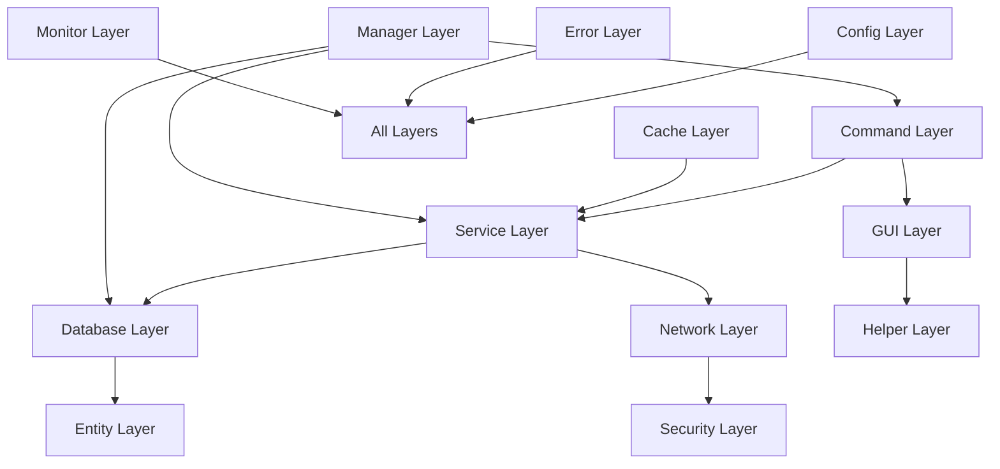

# BilibiliVideoPro 项目地图

## 📋 项目概览

BilibiliVideoPro 是一个基于 TabooLib 的 Minecraft 哔哩哔哩互动插件，具有模块化架构设计。本文档提供了完整的项目结构导航和模块说明。

## 🗂️ 目录结构

```
BilibiliVideoPro/
├── 📁 src/main/kotlin/online/bingzi/bilibili/video/pro/
│   ├── 🎯 BilibiliVideoPro.kt                    # 插件主类
│   ├── 📁 api/                                   # 公共API接口
│   │   └── 📁 event/                            # 事件定义
│   └── 📁 internal/                             # 内部实现
│       ├── 📁 cache/                            # 缓存管理
│       │   └── 🔧 CacheCleanupManager.kt        # 缓存清理管理器
│       ├── 📁 command/                          # 命令处理
│       │   └── 💻 BilibiliVideoProCommand.kt    # 主命令处理器
│       ├── 📁 config/                           # 配置管理
│       │   └── ⚙️ DatabaseConfig.kt             # 数据库配置
│       ├── 📁 database/                         # 数据库层
│       │   ├── 🗄️ DatabaseManager.kt           # 数据库管理器
│       │   ├── 📁 entity/                       # 数据实体
│       │   │   ├── 👤 PlayerBilibili.kt         # 玩家B站绑定实体
│       │   │   └── 📹 VideoInteractionRecord.kt # 视频互动记录实体
│       │   ├── 📁 provider/                     # 数据库提供者
│       │   │   ├── 🔌 IDatabaseProvider.kt      # 数据库提供者接口
│       │   │   ├── 🐬 MySQLProvider.kt          # MySQL实现
│       │   │   └── 📦 SQLiteProvider.kt         # SQLite实现
│       │   ├── 📁 service/                      # 业务服务
│       │   │   ├── 👥 PlayerBilibiliService.kt  # 玩家B站服务
│       │   │   └── 🎬 VideoInteractionService.kt # 视频互动服务
│       │   └── 📁 transaction/                  # 事务管理
│       │       └── 🔄 SimpleTransactionManager.kt # 简单事务管理器
│       ├── 📁 entity/                           # 数据传输对象
│       │   ├── 📁 database/                     # 数据库相关实体
│       │   │   ├── 🗂️ DatabaseType.kt           # 数据库类型
│       │   │   └── 📁 service/
│       │   │       └── 📊 PlayerStatistics.kt   # 玩家统计
│       │   └── 📁 network/                      # 网络请求响应实体
│       │       ├── 🌐 ApiResponse.kt            # API响应基类
│       │       ├── 📁 auth/                     # 认证相关
│       │       │   ├── 🔄 CookieRefreshResult.kt # Cookie刷新结果
│       │       │   ├── 🔍 LoginPollResult.kt     # 登录轮询结果
│       │       │   ├── ✅ LoginStatusResult.kt    # 登录状态结果
│       │       │   ├── 👤 LoginUserInfo.kt       # 登录用户信息
│       │       │   ├── 📱 QRCodeData.kt          # 二维码数据
│       │       │   └── 📲 QRCodeResult.kt        # 二维码结果
│       │       └── 📁 video/                    # 视频相关
│       │           ├── 💭 CommentCheckResult.kt  # 评论检查结果
│       │           ├── 👥 FollowResult.kt        # 关注结果
│       │           ├── 🎯 TripleActionResult.kt  # 三连操作结果
│       │           ├── 📈 TripleActionStatus.kt  # 三连状态
│       │           ├── 📺 VideoData.kt          # 视频数据
│       │           ├── 📝 VideoDetailResult.kt   # 视频详情结果
│       │           ├── 🎬 VideoInteractionResult.kt # 视频互动结果
│       │           └── 🎭 VideoInteractionStatus.kt # 视频互动状态
│       ├── 📁 error/                            # 错误处理
│       │   └── 🚨 ErrorHandler.kt               # 错误处理器
│       ├── 📁 gui/                              # 图形界面
│       │   ├── 🎨 GuiManager.kt                 # GUI管理器
│       │   ├── 📁 builder/                      # GUI构建器
│       │   │   └── 🔧 ConfigurableGuiBuilder.kt # 可配置GUI构建器
│       │   ├── 📁 config/                       # GUI配置
│       │   │   └── ⚙️ GuiConfigManager.kt       # GUI配置管理器
│       │   ├── 📁 handler/                      # GUI处理器
│       │   │   └── 🎯 GuiActionHandler.kt       # GUI动作处理器
│       │   └── 📁 menu/                         # 菜单界面
│       │       ├── 🛠️ AdminGui.kt               # 管理员界面
│       │       ├── 🏠 MainMenuGui.kt            # 主菜单界面
│       │       ├── 📊 PlayerStatsGui.kt         # 玩家统计界面
│       │       └── 📹 VideoListGui.kt           # 视频列表界面
│       ├── 📁 helper/                           # 辅助工具
│       │   ├── 🔮 KetherHelper.kt               # Kether脚本助手
│       │   ├── 🗺️ MapItemHelper.kt              # 地图物品助手
│       │   ├── 🔧 NMSHelper.kt                  # NMS助手
│       │   └── 📱 QRCodeHelper.kt               # 二维码助手
│       ├── 📁 manager/                          # 管理器
│       │   └── 🎮 PluginManager.kt              # 插件管理器
│       ├── 📁 monitor/                          # 系统监控
│       │   └── 📊 SystemMonitor.kt              # 系统监控器
│       ├── 📁 network/                          # 网络层
│       │   ├── 🌐 BilibiliApiClient.kt          # B站API客户端
│       │   ├── 🍪 BilibiliCookieJar.kt          # Cookie管理器
│       │   ├── 🔧 BilibiliNetworkManager.kt     # 网络管理器
│       │   ├── 📁 auth/                         # 认证服务
│       │   │   ├── 🔄 CookieRefreshService.kt   # Cookie刷新服务
│       │   │   └── 📱 QRCodeLoginService.kt     # 二维码登录服务
│       │   └── 📁 video/                        # 视频服务
│       │       └── 🎬 VideoInteractionService.kt # 视频互动服务
│       ├── 📁 security/                         # 安全模块
│       │   ├── 🔒 CookieEncryption.kt           # Cookie加密
│       │   ├── 🛡️ LogSecurityFilter.kt          # 日志安全过滤器
│       │   └── 🔐 SecureKeyManager.kt           # 安全密钥管理器
│       └── 📁 validation/                       # 数据验证
│           └── ✅ InputValidator.kt              # 输入验证器
├── 📁 src/main/resources/                       # 资源文件
│   ├── ⚙️ config.yml                            # 主配置文件
│   ├── 🗄️ database.yml                          # 数据库配置
│   ├── 📁 gui/                                  # GUI配置文件
│   │   ├── 🌐 config.yml                        # GUI全局配置
│   │   ├── 🎨 themes.yml                        # 主题配置
│   │   ├── 🔊 effects.yml                       # 音效配置
│   │   ├── 🏠 main_menu.yml                     # 主菜单配置
│   │   ├── 📹 video_list.yml                    # 视频列表配置
│   │   ├── 📊 player_stats.yml                  # 玩家统计配置
│   │   └── 🛠️ admin_panel.yml                   # 管理员面板配置
│   └── 📁 lang/                                 # 语言文件
│       └── 🇨🇳 zh_CN.yml                        # 中文语言
├── 📁 docs/                                     # 文档目录
│   ├── 📖 DATABASE_USAGE.md                     # 数据库使用指南
│   ├── 🔧 HELPER_USAGE.md                       # 辅助工具使用指南
│   ├── 📋 IMPLEMENTATION_SUMMARY.md             # 实现概要
│   ├── 🌐 NETWORK_USAGE.md                      # 网络使用指南
│   └── 🗺️ PROJECT_MAP.md                        # 项目地图 (本文档)
├── 📄 README.md                                 # 项目说明
├── 📄 CLAUDE.md                                 # Claude开发指南
├── 📄 LICENSE                                   # 许可证
└── 🔧 build.gradle.kts                          # 构建脚本
```

## 🏗️ 架构层次

### 1. 📡 表示层 (Presentation Layer)
- **命令处理** (`command/`): 处理玩家命令输入
- **图形界面** (`gui/`): 提供可视化交互界面
- **辅助工具** (`helper/`): 提供便捷的功能助手

### 2. 🧠 业务逻辑层 (Business Logic Layer)
- **服务层** (`database/service/`): 核心业务逻辑
- **网络服务** (`network/`): B站API集成
- **缓存管理** (`cache/`): 性能优化缓存
- **安全模块** (`security/`): 数据安全保护

### 3. 💾 数据访问层 (Data Access Layer)
- **数据库管理** (`database/`): 数据持久化
- **实体定义** (`entity/`): 数据模型
- **数据验证** (`validation/`): 数据完整性

### 4. 🔧 基础设施层 (Infrastructure Layer)
- **配置管理** (`config/`): 系统配置
- **错误处理** (`error/`): 异常管理
- **系统监控** (`monitor/`): 性能监控
- **插件管理** (`manager/`): 生命周期管理

## 🎯 核心功能模块

### 🔐 认证系统
```
network/auth/
├── QRCodeLoginService.kt     # 二维码登录流程
├── CookieRefreshService.kt   # Cookie自动刷新
└── CookieEncryption.kt       # Cookie安全加密
```

### 🎬 视频互动系统
```
network/video/
├── VideoInteractionService.kt # 视频互动API
database/service/
├── VideoInteractionService.kt # 视频互动业务逻辑
└── PlayerBilibiliService.kt   # 玩家B站账户服务
```

### 💾 数据管理系统
```
database/
├── DatabaseManager.kt        # 数据库连接管理
├── provider/                 # 多数据库支持
│   ├── IDatabaseProvider.kt  # 数据库抽象接口
│   ├── SQLiteProvider.kt     # SQLite实现
│   └── MySQLProvider.kt      # MySQL实现
└── transaction/              # 事务管理
    └── SimpleTransactionManager.kt
```

### 🎨 用户界面系统
```
gui/
├── GuiManager.kt             # GUI统一管理
├── config/GuiConfigManager.kt # GUI配置管理
├── menu/                     # 各类菜单界面
│   ├── MainMenuGui.kt        # 主菜单
│   ├── PlayerStatsGui.kt     # 玩家统计
│   ├── VideoListGui.kt       # 视频列表
│   └── AdminGui.kt           # 管理员界面
└── builder/ConfigurableGuiBuilder.kt # 可配置GUI构建
```

### 🛡️ 安全系统
```
security/
├── LogSecurityFilter.kt      # 日志安全过滤
├── SecureKeyManager.kt       # 密钥管理
└── CookieEncryption.kt       # Cookie加密
```

### 🚀 缓存系统
```
cache/
└── CacheCleanupManager.kt    # 智能缓存清理
    ├── 玩家冷却缓存 (10分钟)
    ├── 视频冷却缓存 (1小时)
    └── 登录会话缓存 (10分钟)
```

## 🔗 模块依赖关系



## 🎨 配置文件架构

### 📁 GUI配置系统
```
resources/gui/
├── config.yml              # 全局GUI配置
├── themes.yml               # 主题系统配置
├── effects.yml              # 音效和动画配置
├── main_menu.yml            # 主菜单布局
├── video_list.yml           # 视频列表布局
├── player_stats.yml         # 玩家统计布局
└── admin_panel.yml          # 管理员面板布局
```

### ⚙️ 系统配置
```
resources/
├── config.yml               # 主配置 (奖励、冷却等)
├── database.yml             # 数据库配置
└── lang/zh_CN.yml           # 本地化配置
```

## 🚀 核心特性

### ✨ 现代化架构
- **模块化设计**: 高内聚、低耦合的模块结构
- **依赖注入**: 使用TabooLib的依赖管理
- **异步处理**: 非阻塞的网络和数据库操作
- **事务管理**: 确保数据一致性

### 🛡️ 安全特性
- **敏感信息过滤**: 自动过滤日志中的敏感数据
- **Cookie加密**: 安全存储用户认证信息
- **输入验证**: 防止恶意输入和SQL注入
- **权限控制**: 细粒度的权限管理

### 🚄 性能优化
- **智能缓存**: 多层缓存机制，自动清理过期数据
- **连接池**: 数据库连接池管理
- **异步API**: 非阻塞的网络请求
- **资源管理**: 自动资源清理和回收

### 🎨 用户体验
- **可配置GUI**: 完全自定义的界面系统
- **多主题支持**: 灵活的主题切换
- **国际化**: 多语言支持
- **错误处理**: 友好的错误提示

## 🔍 快速导航

### 🏁 新手入门
1. 阅读 [README.md](../README.md) 了解项目概况
2. 查看 [CLAUDE.md](../CLAUDE.md) 学习开发规范
3. 参考 [DATABASE_USAGE.md](DATABASE_USAGE.md) 配置数据库
4. 查看 [NETWORK_USAGE.md](NETWORK_USAGE.md) 了解网络集成

### 🧩 模块开发
- **命令开发**: `command/BilibiliVideoProCommand.kt`
- **GUI开发**: `gui/` 目录和配置文件
- **网络集成**: `network/` 目录
- **数据库操作**: `database/service/` 目录

### 🔧 配置管理
- **主配置**: `resources/config.yml`
- **GUI配置**: `resources/gui/` 目录
- **数据库配置**: `resources/database.yml`
- **语言配置**: `resources/lang/zh_CN.yml`

### 🐛 问题排查
- **错误处理**: `error/ErrorHandler.kt`
- **日志过滤**: `security/LogSecurityFilter.kt`
- **系统监控**: `monitor/SystemMonitor.kt`
- **输入验证**: `validation/InputValidator.kt`

## 📚 相关文档

- [项目说明](../README.md) - 项目概况和使用指南
- [开发指南](../CLAUDE.md) - 开发规范和最佳实践
- [数据库使用](DATABASE_USAGE.md) - 数据库配置和使用
- [网络使用](NETWORK_USAGE.md) - 网络API集成指南
- [辅助工具](HELPER_USAGE.md) - 工具类使用说明
- [实现概要](IMPLEMENTATION_SUMMARY.md) - 技术实现详情

---

*最后更新: 2025-07-04*
*版本: 基于 commit c298ab2419c36edc4599097a4b9fda83724eb8e8*